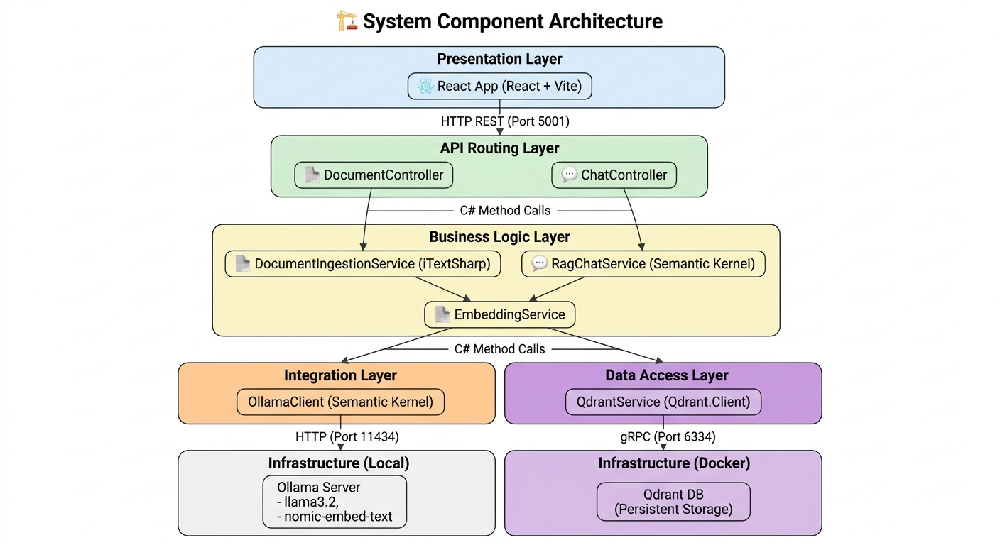

# DocMind 🧠 — Chat with Your Documents

DocMind is a self-hosted, private Retrieval-Augmented Generation (RAG) platform. It allows teams or individual users to upload business documents (like PDFs) and have natural, interactive conversations with that content securely, privately, and completely offline.

---
# System Architecture


## 🚀 Key Value Propositions

* **100% Data Sovereignty:** Every document text snippet, vector embedding calculation, and AI inference cycle stays entirely on your local machine. No third-party APIs (like OpenAI) are used.
* **Zero Infrastructure Cost:** Built completely using free, open-source local models and native framework drivers.
* **Traceable Answers:** Eliminates AI hallucinations by forcing the model to cite the exact source file and text segment it used to formulate its response.

---

### Technical Stack Component Registry

| Component | Technology | Responsibility |
| :--- | :--- | :--- |
| **React App** | React + Vite | User interface — upload files, display chat and source citations. |
| **DocumentController** | ASP.NET Core | Handles file upload multipart HTTP requests. |
| **ChatController** | ASP.NET Core | Handles question/answer prompt HTTP endpoints. |
| **DocumentIngestionService** | C# + UglyToad.PdfPig | Extracts raw text layout, orchestrates 500-character chunking with 50-character overlap. |
| **RagChatService** | C# (Native RAG Engine) | Vectorizes user queries, fetches relevant text via gRPC, constructs strict system context prompts. |
| **HttpClient** | System.Net.Http | Direct, high-performance JSON communication with the local Ollama API wrapper. |
| **QdrantClient** | Qdrant.Client | Direct database interface driver to map native PointStruct payloads over gRPC channels. |
| **Ollama (llama3.2)** | Ollama (Local) | Local text LLM that generates natural language answers strictly from context boundaries. |
| **Ollama (nomic-embed-text)**| Ollama (Local) | Local text embedding generator (outputs 768-dimensional mathematical vector arrays). |
| **Qdrant** | Qdrant (Docker) | High-performance, persistent vector database server with native HNSW indexing. |

---

## 🔄 Core Application Workflows

### Flow 1 — Document Ingestion (One-time Setup)
1. **React:** User selects file. Axios posts file to `/api/document/upload` via `FormData`.
2. **DocumentController:** Receives and validates multipart request, hands stream to `DocumentIngestionService`.
3. **DocumentIngestionService:** Extracts raw document strings completely offline using `UglyToad.PdfPig`.
4. **DocumentIngestionService:** Slices text layouts into 500-character windows with a 50-character sliding semantic overlap to preserve sentences across boundaries.
5. **DocumentIngestionService:** Sends text strings directly via `HttpClient` to local Ollama running `nomic-embed-text` to compute vectors.
6. **DocumentIngestionService:** Assembles native `PointStruct` elements and batch-upserts data vectors and metadata fields (filename, page) directly into the Qdrant container over gRPC.
7. **DocumentController:** Confirms ingestion with a `200 OK` status, returning processing summary metadata.
8. **React:** Appends document data to the sidebar registry.

### Flow 2 — Question Answering Loop (RAG)
1. **React:** User submits question string to `/api/chat/ask`.
2. **ChatController:** Validates structure, routes payload to `RagChatService`.
3. **RagChatService:** Encodes user's question into a 768-dimension coordinate vector via `HttpClient` request to local `nomic-embed-text`.
4. **RagChatService:** Executes native vector search using `QdrantClient.SearchAsync` to fetch the top 4 closest matching chunks.
5. **RagChatService:** Extracts matching payloads, assembles user-facing provenance arrays, and glues the text blocks into a strict system context instruction prompt template.
6. **RagChatService:** Dispatches the final context-grounded prompt template over to local `llama3.2` using a non-streaming HTTP connection payload.
7. **RagChatService:** Packages the model’s literal response alongside source citations metadata (File Name, Page Number).
8. **ChatController:** Returns structural JSON containing `{ answer, sources }`.
9. **React:** Hydrates the UI with responsive bubbles containing clickable markdown source citations.

---

## 🔌 API Specification

### Document Management
* `POST /api/document/upload` - Upload file object (`FormData`). Returns `{ message, fileName, chunksCreated }`.

### Conversation Loops
* `POST /api/chat/ask` - Submits `{ question, conversationId }`. Returns `{ answer, sources: [{ documentName, pageNumber, relevantExcerpt }] }`.
* 
---

## 🔒 Security Configuration Standards

* **Zero Key Leaks:** No cloud keys, environment tokens, or billing variables live inside the codebase.
* **Encrypted Traffic Channels:** Local infrastructure maps direct connection bindings using native ASP.NET `UseHttpsRedirection` pipelines.
* **Runtime File Validation:** Input controls strictly parse binary extensions and constrain incoming file uploads to clear safety limits.
* **Zero Hallucination Prompts:** System prompts apply explicit negative boundary constraints ("If you cannot find the answer, reply only with 'I could not find relevant information in your documents'").

---

## 🛠️ Local Installation & Launch

### Prerequisites
1. Install the [.NET 9 SDK](https://dotnet.microsoft.com/download)
2. Install [Ollama](https://ollama.com/) and download the models:
   ```bash
   ollama pull llama3.2
   ollama pull nomic-embed-text
